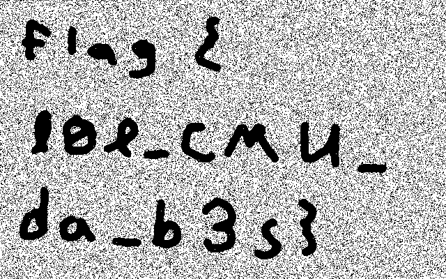

unknown
=======
This Challenge was quite obvious:

> 	We recovered this file from a nearby computer. Maybe you can tell us what it means?

```
\begindata{raster,1}
2 0 65536 65536 0 0 640 400
bits 1 640 400
5a5c0b2f620b86f56c220475ab06266540dc7a04d980a3111a8008526d2a828130g!08422580010240a01441h084124010861700212g018022208dg07g0401c00bg0e4032089232g80g82 |
4534gc6458010g0108200881g89a008g45111201c84003400480gb0308e80480520123422b0020408b180a403g!49g483802c3010c284248g145002118087g08g02040848g10080d6508 |
...<snip>...
400819e6!800524!804480041820244104020b0380242606i32800cg80c00a8641a080bc6020c504g044821026501880c5ag0bg02gae230a1280g084c48902460g01031802g25h |
\enddata{raster, 1}
```

Find something to read the file and we should get the flag.

The content of the file was pure ascii containig some keywords like `begindata`, `enddata`, `raster`... Combining these words with some google-foo led us to [http://fileformats.archiveteam.org/wiki/CMU_Andrew_Toolkit_image](http://fileformats.archiveteam.org/wiki/CMU_Andrew_Toolkit_image).

Using the listed tool [atktopbm](http://netpbm.sourceforge.net/) converts the unknown file into a `pbm` file, which could be opened in LibreOffice and reveals the flag:


